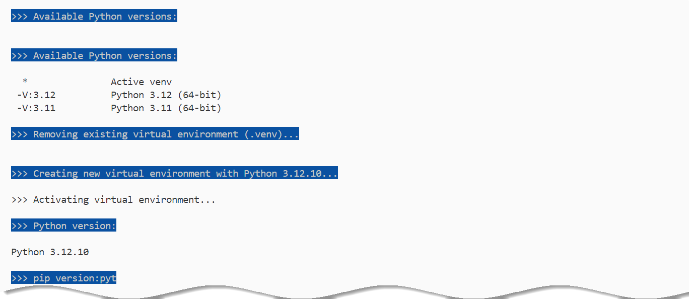
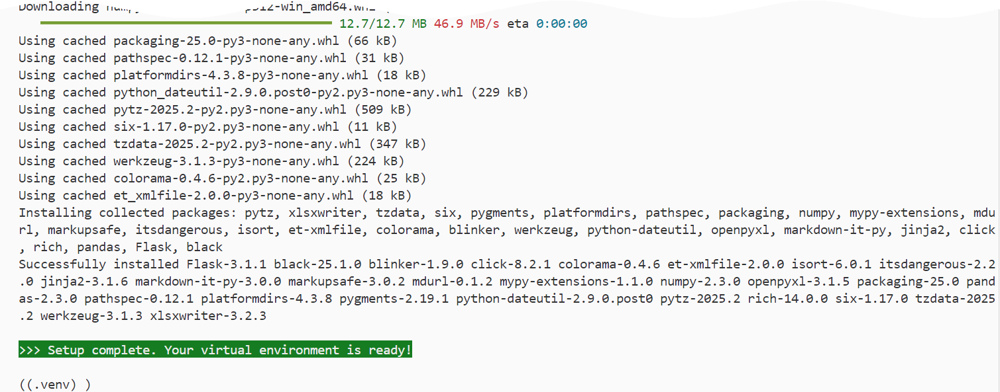
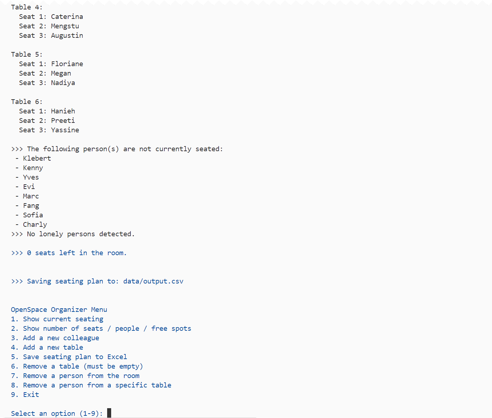
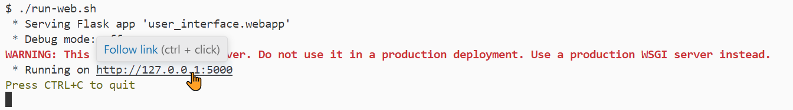
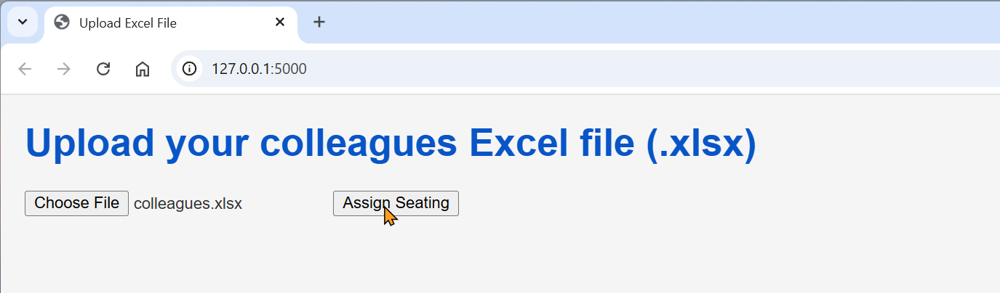
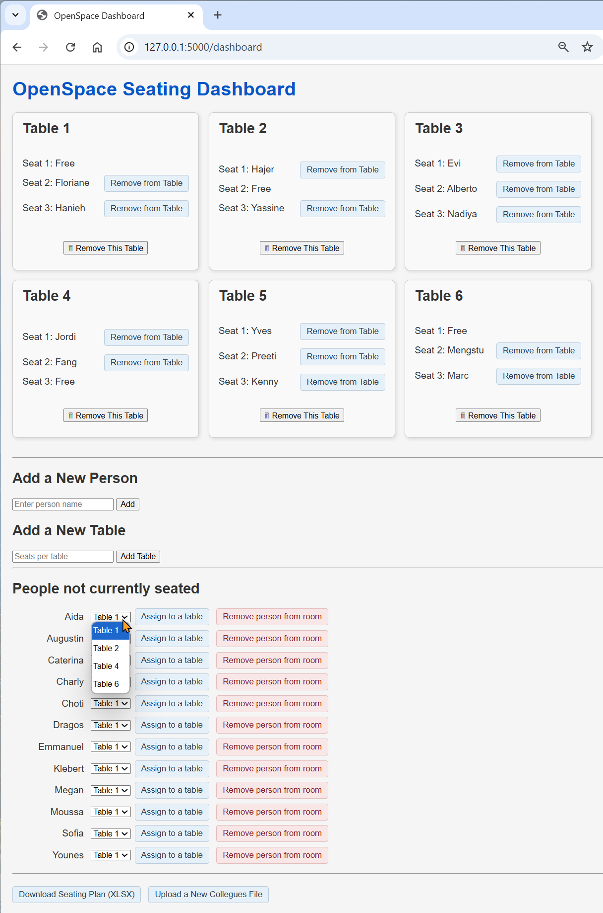

# Openspace Project

## Prerequisites

Before running this project, ensure that Python 3.12.10 is installed on your system.

- You can download Python 3.12.10 from the official website:  
https://www.python.org/downloads/release/python-31210/

- Make sure the `python.exe` path is added to your system environment variables (`PATH`) so it can be accessed via terminal:
-  On Windows, this is typically located at:  
`C:\Users\<YourUserName>\AppData\Local\Programs\Python\Python312\python.exe`

> ⚠️ This project is configured to create a virtual environment using Python 3.12.10. Other versions may lead to compatibility issues.

## Python Environment Setup

This project uses a **virtual environment** to manage Python dependencies in isolation from your system installation.  
This is done using the `.venv/` folder, which contains a local version of Python and all required packages for the project.

> **Why use a virtual environment?**  
> It ensures:
> - Your project runs with the exact versions of libraries it needs.
> - No conflicts with other Python projects or your system installation.
> - Clean and reproducible development environments.

### Step-by-step setup

To initialize the Python environment for this project, follow these steps:

1. **Open a Bash-compatible terminal**  
   Use Git Bash (recommended on Windows) or WSL if you're on Linux/macOS.

2. **Make the setup script executable**  
   Run the following command once to make the script executable:
   ```bash
   chmod +x setup-env.sh
   ```

3. **Run the setup script**
   ```bash
   ./setup-env.sh
   ```

This script will:
- Remove any existing `.venv/` folder.
- Create a new virtual environment using **Python 3.12.10**.
- Automatically activate the environment.
- Upgrade `pip`.
- Install all required packages from `requirements.txt`.
- Create a new `.venv/` folder in the project root to isolate dependencies.

  
  


> After those steps, your environment is fully set up and ready for development or testing.

## Running the Application

You can run this project in two different modes depending on your use case:

- **Command-line interface (CLI)** — for quick testing or automation
- **Web interface** — for a more user-friendly experience via a browser

### Run the Command-line interface (CLI)
To run the `main.py` script from your Git Bash terminal within Visual Studio Code, follow these steps:

1. **Make the setup script executable** 
    ```bash
    chmod +x run-main.sh
    ```

2. **Run the setup script**
   ```bash
   ./run-main.sh
   ```


This will:

- Activate the Python virtual environment
- Launch main.py
- Load the Excel file (data/colleagues.xlsx)
- Assign people to tables and seats automatically
- Save the output to data/output.csv
- Display any unseated persons in the terminal

  

Once the program is running, the following actions can be performed through the menu:

- View the current seating arrangement
- Display statistics: total seats, seated people, and available spots
- Add a new colleague to the room
- Add a new table with seats
- Export the seating plan to an Excel-compatible CSV file
- Remove an empty table
- Remove a person from the room entirely
- Remove a person from a specific table
- Exit the application

### Run the Web Interface

To start the web application from your Git Bash terminal in Visual Studio Code, execute:

1. **Make the setup script executable** 
    ```bash
    chmod +x run-web.sh
    ```

2. **Run the setup script**
   ```bash
   ./run-web.sh
   ```
Then open your browser and navigate to:
   ```bash
   http://127.0.0.1:5000
   ```

  


From there you can:
- Upload a .xlsx file with names (in data folder, use **colleagues.xlsx** file)
- Click on ```Assign Seating``` button, in order to show the OpenSpace Seating Dashboard

 

## OpenSpace Seating Dashboard – Web Interface

The **OpenSpace Seating Dashboard** provides a user-friendly overview and management interface for assigning colleagues to tables.  
The main features on this screen include:

###  Table Overview Cards
Each card (`Table 1`, `Table 2`, ...) displays the current seat status (occupied or free) and allows the user to:

- See who is seated where
- Remove individuals from specific seats
- Remove entire empty tables

### Add a New Person
A simple input field to add a new unassigned person to the room.

### Add a New Table
Lets you define a new table by specifying the number of seats.

### Unseated People List
Displays all individuals who are currently not seated. For each person, you can:

- Select a table from a dropdown (filtered to only show tables with available seats)
- Assign them to the selected table
- Remove them entirely from the room

###  Bottom Action Bar
-  **Download Seating Plan (XLSX)**: Export the current seating arrangement to Excel  
-  **Upload a New Colleagues File**: Restart the process with a new participant list

---

This screen is dynamically updated after each interaction to reflect the current state of the room layout and participants.


- View the seating arrangement by table and seat
  
   
 


- Download the output as a .csv file
- Re-upload another file for a new plan

>The web mode uses the config.json file to determine parameters like number of tables and seats per table.

### Dynamic Configuration via config.json
The program automatically reads its setup from a `config.json` file located in the project root. This allows you to easily configure the room layout and input/output paths without modifying the Python code.

Example content of `config.json`:

```json
{
  "input_csv": "data/colleagues.xlsx",
  "output_csv": "data/output.csv",
  "output_excel": "data/colleagues.xlsx",
  "tables": 6,
  "seats_per_table": 3
}
```

### Parameter Breakdown

- **`input_csv`** *(string)*  
  Path to the Excel file that contains the list of colleagues. This file will be used to load the names to assign.

- **`output_csv`** *(string)*  
  Path where the program will write the final seating arrangement as a `.csv` file. Useful for external sharing or historical tracking.

- **`output_excel`** *(string)*  
  *(Optional)* If present, the program will also export the final seating arrangement to an Excel file at this location.

- **`tables`** *(integer)*  
  Number of tables available in the open space. For example, `6` tables.

- **`seats_per_table`** *(integer)*  
  Number of seats per table. For example, `3` seats per table means a total capacity of 18 people.

  - If the number of people is less than the total available seats, some seats will remain empty.
  - If the number of people is greater than the total available seats, some people will not be seated.

*By editing this file, you can adapt the room layout and input/output behavior without changing a single line of Python code.*


## Feature Implementation Checklist

| Feature Category            | Feature Description                                                                                      | Status      |
|-----------------------------|----------------------------------------------------------------------------------------------------------|-------------|
| **Core Logic**              | Load colleagues from Excel file                                                                          | ✅ Done     |
|                             | Randomly assign colleagues to available seats                                                            | ✅ Done     |
|                             | Show number of seats left                                                                                | ✅ Done     |
|                             | Handle case with too many people                                                                         | ✅ Done     |
| **OOP & Architecture**      | Use clean OOP structure (Seat, Table, Openspace classes)                                                 | ✅ Done     |
|                             | Add proper typing for all methods                                                                        | ✅ Done     |
|                             | Include docstrings in every function/class                                                               | ✅ Done     |
|                             | Use proper import statements                                                                             | ✅ Done     |
|                             | Clean architecture with modular folders                                                                  | ✅ Done     |
| **Basic CLI Features**      | Display tables and occupants                                                                             | ✅ Done     |
|                             | Save seating plan to `.csv`                                                                              | ✅ Done     |
| **Advanced CLI Features**   | Add new colleague dynamically                                                                            | ✅ Done     |
|                             | Add new table dynamically                                                                                | ✅ Done     |
|                             | Remove a colleague from a table or room                                                                  | ✅ Done     |
|                             | Prevent lonely people at a table (eliminate lonely tables)                                               | ✅ Done     |
|                             | Show number of people, free seats, and total capacity                                                    | ✅ Done     |
| **Config Support**          | Use `config.json` to dynamically configure number of tables/seats                                        | ✅ Done     |
| **Web Interface**           | Upload Excel file via web form                                                                           | ✅ Done     |
|                             | Display seating plan in HTML                                                                             | ✅ Done     |
|                             | Allow download of result `.csv` from browser                                                             | ✅ Done     |
|                             | Use Flask web server                                                                                     | ✅ Done     |
| **UI Features (HTML)**      | Display tables and seats clearly                                                                         | ✅ Done     |
|                             | Show unseated colleagues (if any)                                                                        | ✅ Done     |
|                             | Allow uploading another file                                                                             | ✅ Done     |
| **Bonus Features (Not Yet)**| Use blacklist/whitelist seating preferences from Excel (e.g., X wants to sit next to Y)                  | ❌ Not done |
|                             | More advanced UI interaction to manage tables and seats)                                                     | ✅ Done |
|                             | Dynamic seat/table reordering from UI (React advised)                                                                   | ❌ Not done |
| **Code Quality & Git**      | Black formatting                                                                                         | ✅ Done     |
|                             | Remove unused code and comments                                                                          | ✅ Done     |
|                             | Proper GitHub repo setup                                                                                 | ✅ Done     |
|                             | Git feature branching & PRs (if in team)                                                                 | ✅ Done     |
|                             | README file with structure and visuals                                                                   | ✅ Done     |


## License

This project is open-source and available under the MIT License.  
Feel free to fork, adapt, and contribute!

## Author

Created by [Yves Schillings](https://github.com/yves-schillings)  
For feedback or contributions, feel free to open an issue or pull request.
